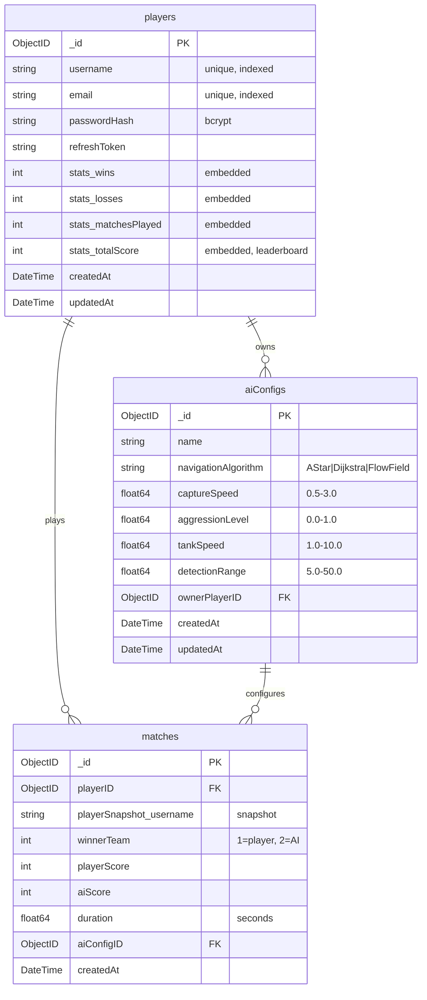

# War of Tanks — MongoDB ERD

## Collections

### players
| Field | Type | Constraints | Notes |
|---|---|---|---|
| `_id` | ObjectID | PK, auto-generated | MongoDB default |
| `username` | string | required, unique, indexed | Login identifier |
| `email` | string | required, unique, indexed | |
| `passwordHash` | string | required | bcrypt — never plain text |
| `refreshToken` | string | optional | Stored for JWT rotation |
| `stats.wins` | int | default: 0 | **Embedded** — see justification |
| `stats.losses` | int | default: 0 | |
| `stats.matchesPlayed` | int | default: 0 | |
| `stats.totalScore` | int | default: 0 | Sum of zone capture points — used for leaderboard ranking |
| `createdAt` | DateTime | auto | |
| `updatedAt` | DateTime | auto | Updated on every stat change |

### matches
| Field | Type | Constraints | Notes |
|---|---|---|---|
| `_id` | ObjectID | PK, auto-generated | |
| `playerID` | ObjectID | required, ref → players._id, indexed | |
| `playerSnapshot.username` | string | required | Snapshot at time of match — protects history if username changes |
| `winnerTeam` | int | required, enum: 1\|2 | 1 = player team, 2 = AI team |
| `playerScore` | int | required, min: 0 | Zone capture points — player team |
| `aiScore` | int | required, min: 0 | Zone capture points — AI team |
| `duration` | float64 | required, min: 0 | Seconds |
| `aiConfigID` | ObjectID | optional, ref → aiConfigs._id | Null = default AI config |
| `createdAt` | DateTime | auto | Timestamp of match completion |

### aiConfigs
| Field | Type | Constraints | Notes |
|---|---|---|---|
| `_id` | ObjectID | PK, auto-generated | |
| `name` | string | required | e.g. "Aggressive", "Balanced", "Defensive" |
| `navigationAlgorithm` | string | required, enum: "AStar"\|"Dijkstra"\|"FlowField" | Maps to Unity navigation implementation |
| `captureSpeed` | float64 | required, range: 0.5–3.0 | Multiplier on zone capture rate |
| `aggressionLevel` | float64 | required, range: 0.0–1.0 | 0 = fully defensive, 1 = fully aggressive |
| `tankSpeed` | float64 | required, range: 1.0–10.0 | Movement speed units/s |
| `detectionRange` | float64 | required, range: 5.0–50.0 | FOV radius in Unity units |
| `ownerPlayerID` | ObjectID | optional, ref → players._id | Null = global/default config |
| `createdAt` | DateTime | auto | |
| `updatedAt` | DateTime | auto | |

---

## Relationships

```
players (1) ────────────── (N) matches
    _id  ◄──────────────────  playerID

aiConfigs (1) ──────────── (N) matches
    _id   ◄──────────────────  aiConfigID  [optional]

players (1) ──────────── (N) aiConfigs
    _id   ◄──────────────────  ownerPlayerID  [optional]
```

---

## Embed vs Reference — Decision Log

### stats → embedded in players ✅
**Decision:** Embed `{ wins, losses, matchesPlayed, totalScore }` directly inside the `players` document.

**Why:** Stats are always read together with the player — every leaderboard query, every profile page. As a separate `stats` collection, every leaderboard fetch requires a `$lookup` join, which is expensive and negates MongoDB's document model advantages. Stats are also never queried independently (there is no use case for "give me all stats without the player"). Embedding is the correct MongoDB pattern here.

**Trade-off accepted:** Updating stats requires an atomic `$inc` on the player document. This is safe and idiomatic in MongoDB.

---

### matches → references players._id ✅
**Decision:** Store `playerID` as an ObjectID reference, plus a `playerSnapshot.username` string embedded at match time.

**Why:** Player data mutates (username, stats). If we embedded the full player object, match history would show stale usernames after a rename. Referencing by `_id` is the correct approach for mutable parent entities. The `playerSnapshot.username` embedded field ensures the display name shown in match history is the name the player had *at that time* — this is intentional and correct for audit-trail history.

---

### matches → references aiConfigs._id ✅
**Decision:** Optional ObjectID reference to `aiConfigs`.

**Why:** A single AI config can be used across hundreds of matches (e.g., the "default" config). Embedding would duplicate the full config object in every match document — wasteful and inconsistent (if the config is updated, all embedded copies are stale). Referencing keeps a single source of truth. The field is nullable: `null` means the default system config was used.

---

### aiConfigs → references players._id ✅
**Decision:** Optional ObjectID reference `ownerPlayerID`, nullable.

**Why:** Global/default configs (used for the championship modular AI requirement) have no owner — `ownerPlayerID: null`. Player-specific custom configs reference their owner. This avoids creating a separate "global configs" collection while keeping the data model clean.

---

## DBML Schema (for dbdiagram.io)

Paste this at https://dbdiagram.io to generate the visual diagram, then export as PNG/SVG to `docs/erd/`.

```dbml
Table players {
  _id                 varchar     [pk, note: "ObjectID auto-generated"]
  username            varchar     [not null, unique, note: "indexed"]
  email               varchar     [not null, unique, note: "indexed"]
  passwordHash        varchar     [not null, note: "bcrypt"]
  refreshToken        varchar     [note: "JWT refresh token"]
  stats_wins          int         [not null, default: 0, note: "EMBEDDED"]
  stats_losses        int         [not null, default: 0, note: "EMBEDDED"]
  stats_matchesPlayed int         [not null, default: 0, note: "EMBEDDED"]
  stats_totalScore    int         [not null, default: 0, note: "EMBEDDED - leaderboard rank"]
  createdAt           datetime    [not null]
  updatedAt           datetime    [not null]

  Note: "Embedded stats - always queried with player, never standalone"
}

Table matches {
  _id                     varchar     [pk, note: "ObjectID auto-generated"]
  playerID                varchar     [not null, note: "indexed"]
  playerSnapshot_username varchar     [not null, note: "username at time of match"]
  winnerTeam              int         [not null, note: "1=player team, 2=AI team"]
  playerScore             int         [not null]
  aiScore                 int         [not null]
  duration                float       [not null, note: "seconds"]
  aiConfigID              varchar     [note: "optional - null=default config"]
  createdAt               datetime    [not null]
}

Table aiConfigs {
  _id                 varchar     [pk, note: "ObjectID auto-generated"]
  name                varchar     [not null, note: "e.g. Aggressive, Balanced"]
  navigationAlgorithm varchar     [not null, note: "AStar | Dijkstra | FlowField"]
  captureSpeed        float       [not null, note: "0.5-3.0"]
  aggressionLevel     float       [not null, note: "0.0-1.0"]
  tankSpeed           float       [not null, note: "1.0-10.0 units/s"]
  detectionRange      float       [not null, note: "5.0-50.0 Unity units"]
  ownerPlayerID       varchar     [note: "optional - null=global config"]
  createdAt           datetime    [not null]
  updatedAt           datetime    [not null]

  Note: "Championship modular AI - ownerPlayerID null = default system config"
}

Ref "plays": matches.playerID > players._id
Ref "uses config": matches.aiConfigID > aiConfigs._id
Ref "owns": aiConfigs.ownerPlayerID > players._id
```

---

## Mermaid ERD (alternative visual)



---

## Go Models

All models are aligned with this ERD:

| File | Status |
|---|---|
| `models/player.go` | `PlayerStats` embedded struct + `UpdatedAt` |
| `models/match.go` | `PlayerSnapshot`, `PlayerScore`, `AIScore`, `AIConfigID` (nullable) |
| `models/ai.go` | `AIConfig` with all behavioral params |
| `models/stats.go` | Deleted — stats embedded in Player |
