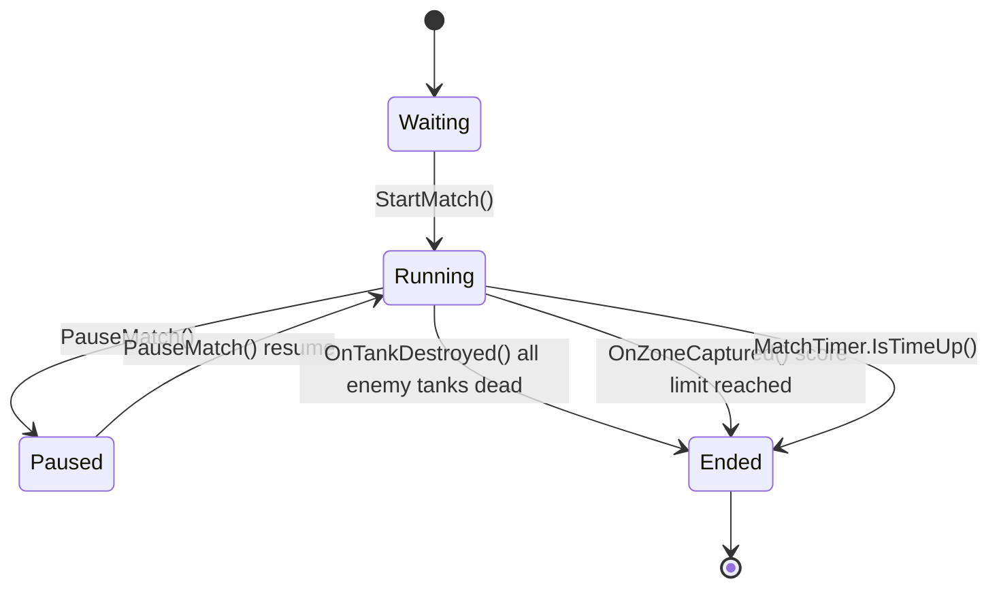

```mermaid
stateDiagram-v2
    [*] --> Waiting

    Waiting --> Running : StartMatch()
    Running --> Paused  : PauseMatch()
    Paused  --> Running : PauseMatch() resume
    Running --> Ended   : OnTankDestroyed() all enemy tanks dead
    Running --> Ended   : OnZoneCaptured() score limit reached
    Running --> Ended   : MatchTimer.IsTimeUp()
    Ended   --> [*]
```