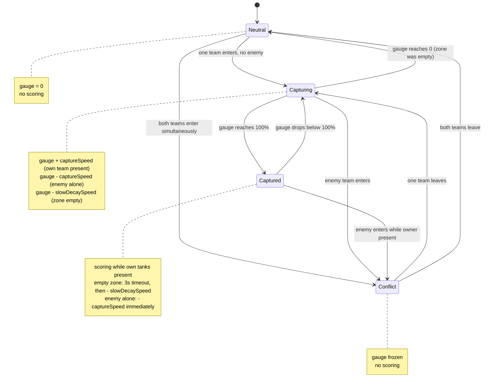

```mermaid
stateDiagram-v2
      [*] --> Neutral

      Neutral --> Capturing : one team enters, no enemy
      Neutral --> Conflict  : both teams enter simultaneously

      Capturing --> Conflict  : enemy team enters
      Capturing --> Captured  : gauge reaches 100%
      Capturing --> Neutral   : gauge reaches 0 (zone was empty)

      Captured --> Capturing  : gauge drops below 100%
      Captured --> Conflict   : enemy enters while owner present

      Conflict --> Capturing  : one team leaves
      Conflict --> Neutral    : both teams leave

      note right of Capturing
          gauge + captureSpeed (own team present)
          gauge - captureSpeed (enemy alone)
          gauge - slowDecaySpeed (zone empty)
      end note

      note right of Captured
          scoring while own tanks present
          empty zone: 3s timeout, then - slowDecaySpeed
          enemy alone: - captureSpeed immediately
      end note

      note right of Conflict
          gauge frozen
          no scoring
      end note

      note right of Neutral
          gauge = 0
          no scoring
      end note
```