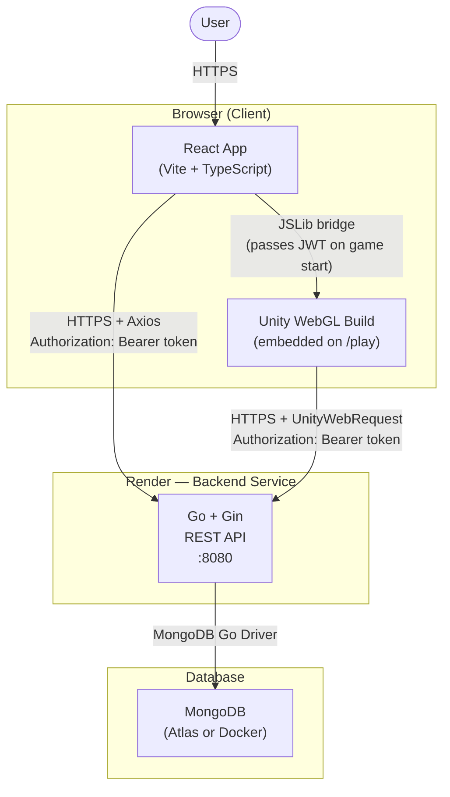
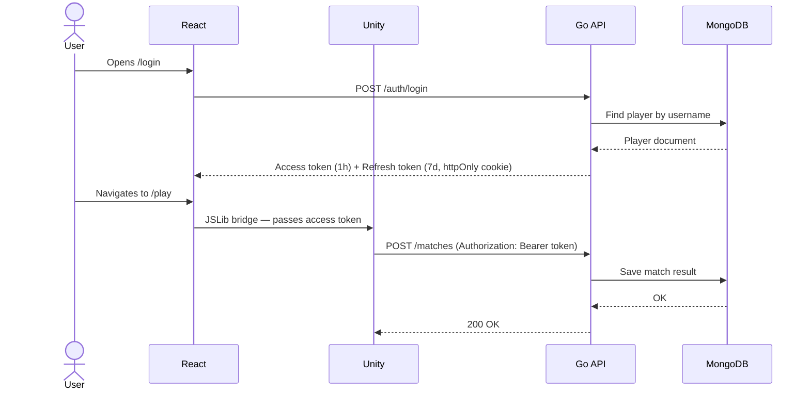

# War of Tanks — System Interaction Schema

This document describes how all systems communicate at runtime.

---

## Architecture Diagram

---

## Interactions Explained

### 1. User → React App
The user accesses the web interface via a browser over HTTPS. The React app is served as a static build (HTML, JS, CSS) from Render.

### 2. React App → Unity WebGL
The Unity game is not a separate deployment. It is loaded as a static WebGL build from `public/unity-build/` inside the React app. When the user navigates to `/play`, the React component initialises the Unity loader and mounts the game canvas.

Once the game is loaded, React passes the player's JWT access token into Unity via the **Unity JSLib bridge** — a JavaScript interop layer that allows the host web page to call functions inside the running Unity instance. This gives Unity the token it needs to make authenticated API calls.

### 3. React App → Go API
All API calls from the React frontend (login, register, leaderboard, match history) go over HTTPS to the Go + Gin backend. Protected routes include the JWT access token in the `Authorization: Bearer <token>` header. Token refresh uses an httpOnly cookie carrying the refresh token.

### 4. Unity WebGL → Go API
During gameplay, Unity makes HTTP calls to the same Go API (e.g. recording a match result at the end of a game). These calls use `UnityWebRequest` and include the JWT access token received from React via the JSLib bridge.

### 5. Go API → MongoDB
The backend reads and writes all persistent data (player accounts, match history, statistics, leaderboard) through the official MongoDB Go driver. The connection string is provided via the `MONGO_URI` environment variable.

---

## Authentication Flow (Sequence)

---

## Deployment Overview

| Component | Platform | Notes |
|---|---|---|
| React App + Unity WebGL | Render (static site) | Single deployment — Unity build in `public/unity-build/` |
| Go + Gin API | Render (web service) | Docker container |
| MongoDB | MongoDB Atlas or Docker | Connection via `MONGO_URI` env variable |
